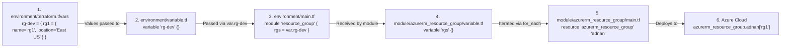
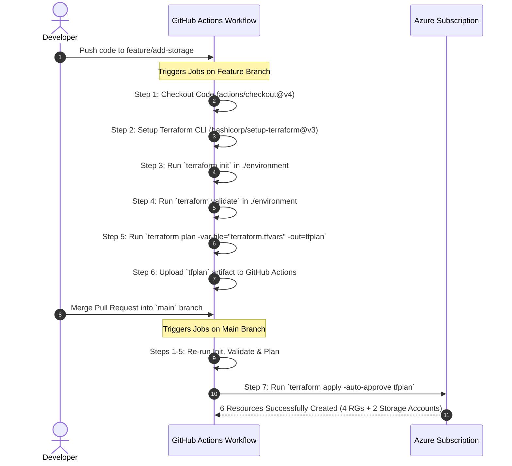

# 📘 Azure Infrastructure Terraform Repository (`b18-infra-repository1`)


This repository provides an automated **Infrastructure as Code (IaC)** pipeline using **HashiCorp Terraform** and **GitHub Actions** to provision Azure Resource Groups and Azure Storage Accounts in Microsoft Azure.

---

## 🎯 1. What Infrastructure Does This Project Create?

When executed, this repository deploys **6 Azure Resources** defined in `environment/terraform.tfvars`:

### 📌 4 Azure Resource Groups
| Resource Name | Azure Region | Defined in `terraform.tfvars` | Purpose |
| :--- | :--- | :--- | :--- |
| `rg1` | `East US` | `rg-dev.rg1` | Container for `str12022` storage account |
| `rg2` | `East US` | `rg-dev.rg2` | Container for `str22031` storage account |
| `rg3` | `East US` | `rg-dev.rg3` | Resource Group for general development |
| `rg4` | `East US` | `rg-dev.rg4` | Resource Group for general development |

### 📌 2 Azure Storage Accounts
| Storage Name | Target Resource Group | Azure Region | Account Tier | Replication |
| :--- | :--- | :--- | :--- | :--- |
| `str12022` | `rg1` | `East US` | `Standard` | `LRS` |
| `str22031` | `rg2` | `East US` | `Standard` | `LRS` |

---

## 🔄 2. Exact Data & Code Flow Breakdown

Here is the exact step-by-step trace of how variable data travels through the files to create resources in Azure.

### Data Flow Diagram for Resource Groups



---

## 📂 3. Complete File Hierarchy & Line-by-Line Code Explanation

Below is the complete project structure and the exact code inside each file.

```text
b18-infra-repository1/
│
├── .github/workflows/
│   └── terraform.yml                  # GitHub Actions CI/CD Pipeline
│
├── environment/                       # Execution directory (Root Module)
│   ├── main.tf                        # Calls Resource Group & Storage Account modules
│   ├── provider.tf                    # Configures AzureRM Provider (v4.80.0)
│   ├── variable.tf                    # Declares root input variables
│   └── terraform.tfvars               # Contains actual resource configuration maps
│
├── module/                            # Reusable Infrastructure Modules
│   ├── azurerm_resource_group/
│   │   ├── main.tf                    # azurerm_resource_group resource definition
│   │   └── variable.tf                # 'rgs' input variable definition
│   │
│   └── azurerm_storage_account/
│       ├── main.tf                    # azurerm_storage_account resource definition
│       └── variable.tf                # 'storage_accounts' input variable definition
│
└── .gitignore                         # Prevents state files and credentials from git tracking
```

---

### File 1: `environment/terraform.tfvars`
**Purpose**: Holds the actual map data for resources to be created.

```hcl
# Defines map of 4 Resource Groups
rg-dev = {
    rg1 = { name = "rg1", location = "East US" }
    rg2 = { name = "rg2", location = "East US" }
    rg3 = { name = "rg3", location = "East US" }
    rg4 = { name = "rg4", location = "East US" }
}

# Defines map of 2 Storage Accounts
str = {
    str1 = {
        name                     = "str12022"
        resource_group_name      = "rg1"
        location                 = "East US"
        account_tier             = "Standard"
        account_replication_type = "LRS"
    }

    str2 = {
        name                     = "str22031"
        resource_group_name      = "rg2"
        location                 = "East US"
        account_tier             = "Standard"
        account_replication_type = "LRS"
    }
}
```

---

### File 2: `environment/variable.tf`
**Purpose**: Declares the root variables that receive data from `terraform.tfvars`.

```hcl
variable "rg-dev" {}    # Receives the rg-dev map from terraform.tfvars
variable "str" {}       # Receives the str map from terraform.tfvars
```

---

### File 3: `environment/main.tf`
**Purpose**: Orchestrates the deployment by calling modules and enforcing creation order.

```hcl
# 1. Calls Resource Group module
module "resource_group" {
  source = "../module/azurerm_resource_group"
  rgs    = var.rg-dev
}

# 2. Calls Storage Account module (Waits for Resource Groups to finish creating)
module "storage_account" {
  depends_on       = [module.resource_group]
  source           = "../module/azurerm_storage_account"
  storage_accounts = var.str
}
```

> [!IMPORTANT]
> **Why `depends_on = [module.resource_group]` is required**:
> Azure Storage Accounts require their target Resource Groups to exist first. `depends_on` forces Terraform to finish creating `rg1` and `rg2` before creating `str12022` and `str22031`.

---

### File 4: `environment/provider.tf`
**Purpose**: Configures the Terraform AzureRM Provider and target versions.

```hcl
terraform {
  required_providers {
    azurerm = {
      source  = "hashicorp/azurerm"
      version = "4.80.0"               # Locks AzureRM provider version to 4.80.0
    }
  }
}

provider "azurerm" {
  features {}                          # Required feature block for AzureRM provider
}
```

---

### File 5: `module/azurerm_resource_group/main.tf`
**Purpose**: The reusable template that builds Azure Resource Groups dynamically.

```hcl
resource "azurerm_resource_group" "adnan" {
  for_each = var.rgs                  # Loops over every entry in var.rgs map
  name     = each.value.name          # Sets Resource Group Name (e.g., "rg1")
  location = each.value.location      # Sets Azure Region (e.g., "East US")
}
```

---

### File 6: `module/azurerm_storage_account/main.tf`
**Purpose**: The reusable template that builds Azure Storage Accounts dynamically.

```hcl
resource "azurerm_storage_account" "name" {
  for_each                 = var.storage_accounts
  name                     = each.value.name                     # e.g., "str12022"
  resource_group_name      = each.value.resource_group_name     # e.g., "rg1"
  location                 = each.value.location                # e.g., "East US"
  account_tier             = each.value.account_tier            # e.g., "Standard"
  account_replication_type = each.value.account_replication_type # e.g., "LRS"
}
```

---

## 🤖 4. How the GitHub Actions CI/CD Pipeline Works

The workflow is defined in `.github/workflows/terraform.yml`.

### Pipeline Branching Logic & Execution Steps



### Required Secrets Setup in GitHub
Navigate to **GitHub Repository > Settings > Secrets and variables > Actions** and add:

| Secret Name | Value Description |
| :--- | :--- |
| `ARM_CLIENT_ID` | Application (Client) ID of Azure Service Principal |
| `ARM_CLIENT_SECRET` | Secret Password of Azure Service Principal |
| `ARM_SUBSCRIPTION_ID` | Azure Subscription ID |
| `ARM_TENANT_ID` | Azure Active Directory Tenant ID |

---

## 🛠️ 5. Step-by-Step Execution Guide

### Option A: Local Execution via Terminal

1. **Open terminal and change directory to `environment/`**:
   ```bash
   cd environment
   ```

2. **Authenticate with Azure**:
   ```bash
   az login
   az account set --subscription "<YOUR_AZURE_SUBSCRIPTION_ID>"
   ```

3. **Initialize Terraform working directory**:
   ```bash
   terraform init
   ```
   *Expected Output*: `Terraform has been successfully initialized!`

4. **Validate syntax correctness**:
   ```bash
   terraform validate
   ```
   *Expected Output*: `Success! The configuration is valid.`

5. **Generate deployment plan**:
   ```bash
   terraform plan -var-file="terraform.tfvars"
   ```
   *Expected Output*: 
   ```text
   Plan: 6 to add, 0 to change, 0 to destroy.
   ```

6. **Apply and create resources in Azure**:
   ```bash
   terraform apply -var-file="terraform.tfvars" -auto-approve
   ```
   *Expected Output*: 
   ```text
   Apply complete! Resources: 6 added, 0 changed, 0 destroyed.
   ```

7. **Destroy deployed resources** (Clean up):
   ```bash
   terraform destroy -var-file="terraform.tfvars" -auto-approve
   ```

---

### Option B: Automated Execution via GitHub Actions

1. Commit your changes to a feature branch:
   ```bash
   git checkout -b feature/update-infra
   git add .
   git commit -m "Configure infrastructure resources"
   git push origin feature/update-infra
   ```
2. Open GitHub and navigate to the **Actions** tab.
3. Review the `terraform plan` execution under the feature workflow.
4. Merge the Pull Request into `main`. The pipeline automatically executes `terraform apply` to provision Azure resources.

---

## 📌 Quick Summary Reference

```text
Input Values (terraform.tfvars)
   │
   ├── rg-dev (rg1, rg2, rg3, rg4) ────────► module.resource_group ──────► Creates 4 Azure Resource Groups
   │
   └── str (str12022, str22031)   ────────► module.storage_account ─────► Creates 2 Azure Storage Accounts
```